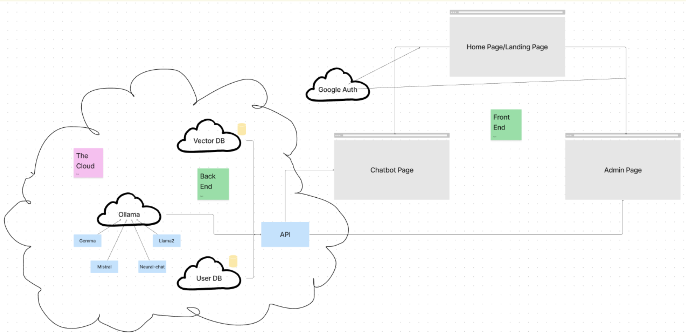

# AgInsuranceLLM
This project aims to address the complexity and confusion surrounding insurance policy selection by developing a conversational assistant tailored for an agricultural insurance program in the US. The assistant will simplify the understanding of insurance terms and aid users in making informed decisions about coverage options. Focusing on the detection of rainfall deficits in insured pasture, forage, and rangelands, the assistant will offer clear explanations, visualizations, and guidance on selecting appropriate insurance terms. Additionally, the project may include simulations to illustrate the potential impact of different choices. Ultimately, this tool seeks to empower users to confidently navigate their insurance options and manage financial risks effectively.

## File Structure
```
.
├── chatbot     <-- fronted
├── ChromaDB    <-- vector db population
├── kube        <-- kubernetes config files
├── LLM         <-- backend
├── redis       <-- user db
└── TestBench   <-- testing files and infrastructure 
```

## System Design
This project is built on a microservices architecture in the cloud, enabling individual scaling of components based on demand. The core architecture comprises separate microservices like the Vector DB, User DB, API, and AI-related services (Gemma, Mistral, Neural-chat, Llama2, Ollama), each independently scalable to accommodate fluctuating loads. The front-end components (Home Page, Chatbot Page, Admin Page) can also scale independently to handle varying user traffic. This microservices approach in the cloud architecture ensures optimal performance, efficient resource utilization, and high scalability across the entire system. 



## Frontend
[More Details Here](#frontend-1)

## Backend
[More Details Here](#llm)

## Ollama
[More Details Here](#llm)

## Databases
### Vector Database - ChromaDB
[More Details Here](#chromadb)

### User DB - Redis
[More Details Here](#redis)

## Testing
[More Details Here](#test-bench)

## Production Deployment

## Insurance Resources  
- [USDA site for insurance computation](https://public-rma.fpac.usda.gov/apps/PRF#)
- Problem with this also lacks significant functionality to support potential policyholders in quickly predicting the impacts of their choices.
- [Insurance Programs](https://www.rma.usda.gov/en/Policy-and-Procedure/Insurance-Plans/Pasture-Rangeland-Forage)
- [Insurance documentation](https://www.rma.usda.gov/-/media/RMA/Handbooks/Coverage-Plans---18000/Rainfall-and-Vegetation-Index---18150/2024-18150-1-Rainfall-Index-Handbook.ashx?la=en)


<div style="page-break-after: always;"></div>


# Frontend

## Table of Contents

1. [File Structure](#file-structure)
2. [Nextjs API](#nextjs-api)
3. [Styling](#styling)
4. [env file](#env-file)
5. [Running Locally](#running-locally)
6. [Pushing to Container Registry](#pushing-to-container-registry)
   - [What is happening under the hood?](#what-is-happening-under-the-hood)
   - [To execute the push to the container registry](#to-execute-the-push-to-the-container-registry)
7. [Recourses](#recourses)
8. [Known Issues](#known-issues)

## File Structure
```
.
└── chatbot/
    ├── app/                        
    │   ├── (chat)/
    │   │   ├── chat/
    │   │   │   └── [id]/
    │   │   │       └── page.tsx    <-- page content for a chat
    │   │   ├── layout.tsx          <-- layout template for chat page
    │   │   └── page.tsx            <-- driver for the chat page
    │   ├── api/
    │   │   ├── auth/
    │   │   │   └── [...nextauth]/  
    │   │   │       └── route.ts    <-- initializes the authjs signin logic
    │   │   ├── chat/
    │   │   │   └── route.ts        <-- server side endpoint that streams the content from backend
    │   │   └── tags/
    │   │       └── route.ts        <-- server side endpoint that gets all available models in Ollama server
    │   ├── share/
    │   │   └── [id]/
    │   │       └── page.tsx        <-- shared chat page
    │   ├── sign-in/
    │   │   └── page.tsx            <-- sign in page
    │   ├── actions.ts              
    │   ├── global.css
    │   └── layout.tsx
    ├── components/
    │   ├── ui/
    │   │   └── {custom components}
    │   └── {shadcn/ui components}
    ├── lib/
    │   └── hooks
    ├── public
    ├── .dockerignore
    ├── .env.example
    ├── .env
    ├── .gitignore
    ├── Dockerfile                  <-- dockerfile that creates a react build
    ├── README.md
    ├── auth.ts                     <-- authjs config file
    ├── docker-compose.yaml         <-- compose file that configures docker build
    ├── dockerpush.sh               <-- bash script that builds a docker image and pushes to image repo
    ├── middleware.ts
    ├── next-env.d.ts
    ├── next.config.js
    ├── package.json
    ├── postcss.config.js
    ├── tailwind.config.js
    └── tsconfig.json
```

## Nextjs API

Next.js API routes allow you to build APIs directly within your Next.js application. They are server-side functions that can receive HTTP requests and return responses. You can use them to handle tasks like interacting with a database, handling form submissions, or even building a full-fledged API. They are created by adding JavaScript files in the app/api directory of your Next.js project.

In this project, three main endpoints are built using api routes to handle auth, chat, and pulling available model tags.

### auth

### chat

### tags

## Styling
- Component Library [shadcn/ui](https://ui.shadcn.com)
- Styling with [Tailwind CSS](https://tailwindcss.com)
- [Radix UI](https://radix-ui.com) for headless component primitives
- Icons from [Phosphor Icons](https://phosphoricons.com)


## env file
Create .env file and copy contents of .env.example into .env

assign these values

``` bash
# Google Auth Credentials
AUTH_GOOGLE_ID=
AUTH_GOOGLE_SECRET=

# Secret key used for encryption in the auth module
AUTH_SECRET=

# Base URL of your backend API
URL=

# The host URL of your application
HOST=

# Base URL of your REDIS REST API
# Token for authenticating with the REDIS REST API
# check README.md in the redis directery for more information
KV_REST_API_URL=
KV_REST_API_TOKEN=

# The base URL of your Next.js application, used by NextAuth for callbacks and redirects
NEXTAUTH_URL=


# _______________ PRODUCTION ONLY _______________ #


# Proxy URL for redirecting during authentication (only needed in production)
AUTH_REDIRECT_PROXY_URL=
```


## Running Locally
### 1. run with local version of node
This method supports hot reload (no need to kill and run again when changes are made).
``` bash
npm run dev
```

### 2. run with docker

This method produces a result in the same format as used in production.
``` bash
docker compose up --build
```

## Pushing to Container Registry

Open dockerpush.sh

```bash
# set these variables
registry=""
username=""
project=""
serviceName=""
```

### What is happening under the hood?
This is an example
```bash
#!/bin/bash

# Define these variables
registry="container.cs.vt.edu"
username="saketh"
project="aginsurancellm"
serviceName="frontend"

# login to the container registry
docker login $registry

# Build the image for a linux/amd64 platform 
docker build --platform linux/amd64 -t $registry/$username/$project/$serviceName .

# Push the image
docker push $registry/$username/$project/$serviceName
```

### To execute the push to the container registry
```bash
bash dockerpush.sh
```

## Recourses
- [Next.js](https://nextjs.org)

## Known Issues
- Sometimes the page does not refresh when `start a new chat` is clicked


<div style="page-break-after: always;"></div>

# LLM

## Table of Contents

1. [File Structure](#file-structure)
2. [API Reference](#api-reference)
   - [Chat](#chat)
   - [Stream Chat](#stream-chat)
3. [env file](#env-file)
4. [Running Locally](#running-locally)
5. [Pushing to Container Registry](#pushing-to-container-registry)
   - [What is happening under the hood?](#what-is-happening-under-the-hood)
   - [To execute the push to the container registry](#to-execute-the-push-to-the-container-registry)
6. [Known Issues](#known-issues)


## File Structure
```
.
└── LLM/
    ├── InsuranceContext/
    │   └── handbook.pdf
    │
    ├── .env.example
    ├── .gitignore
    │
    ├── api.py                  <-- main api file that facilities communication to Ollama (LLMs) and ChromaDB (vectordb)
    ├── Dockerfile              <-- dockerfile, instructions to create environment that runs the api.py
    ├── docker-compose.yaml     <-- compose file that can be used to run Dockerfile
    ├── dockerpush.sh           <-- script to push api Docker image to container registry
    ├── sample_api.py           <-- 
    ├── test_pdf_splitter.py    <-- 
    └── testapi.py              <-- same functionality of api.py, but has alternate segmentation methods
```

## API Reference
This documentation provides information about the endpoints available in the Flask app.

### Chat

```http
  POST /api/chat
```

| Parameter | Type     | Description                                   |
| :-------- | :------- | :-------------------------------------------- |
| `messages`| `array`  | **Required**. Array of user's messages        |
| `model`   | `string` | Optional. Model for chat (default: llama2:chat)|

``` json
{
    "messages": [
        {
            "role": "user",
            "content": "User's message"
        }
    ],
    "model": "llama2:chat"  // Optional, default is "llama2:chat"
}
```

#### Success Response

 **Code:** `200 OK`
 **Content:** 
  ```json
  {
      "text": "Assistant's response",
      "source_tags": ["source_tag_1", "source_tag_2"],
      "source_documents": ["source_document_1", "source_document_2"]
  }
  ```

#### Error Response

 **Code:** `500 Internal Server Error`
 **Content:** 
  ```json
  {
      "error": "Error message"
  }
  ```

### Stream Chat

```http
  POST /api/stream_chat
```

| Parameter | Type     | Description                                   |
| :-------- | :------- | :-------------------------------------------- |
| `messages`| `array`  | **Required**. Array of user's messages        |
| `model`   | `string` | Optional. Model for chat                      |

``` json
{
    "messages": [
        {
            "role": "user",
            "content": "User's message"
        }
    ],
    "model": "llama2:chat"  // Optional, default is "llama2:chat"
}
```

#### Success Response

 **Code:** `200 OK`
 **Content:** Stream of JSON objects containing assistant's responses and citations.

 ``` json
 {text: "Hi, how"} + \x1e + {text: "are you"} ....
 ```

#### Error Response

 **Code:** `500 Internal Server Error`
 **Content:** 
  ```json
  {
      "error": "Error message"
  }
  ```

**Note:** In both endpoints, the assistant's response is generated based on the user's message and context information from relevant documents retrieved from CHROMADB. If an error occurs during the process, an error message is returned.

## env file
Create .env file and copy contents of .env.example into .env

assign these values

``` bash
# this is the URL of the Ollama API
OLLAMA_URL=https://ollamaaginsurance.endeavour.cs.vt.edu/

# this is the URL of the vector database (ChromaDB)
CHROMADB_URL=https://chromadb-ingress.endeavour.cs.vt.edu

# this is the name of the collection in the vector database (ChromaDB)
COLLECTION_NAME=RAINFALL_INDEX_INSURANCE_STANDARDS_HANDBOOK_2024

# this is the OpenAI API key
OPENAI_API_KEY=jdslafjsdlkfjaslkd
```


## Running Locally
```bash 
docker compose up --build
```


## Pushing to Container Registry

Open dockerpush.sh

```bash
# set these variables
registry=""
username=""
project=""
serviceName=""

```

### What is happening under the hood?
This is an example
```bash
#!/bin/bash

# Define these variables
registry="container.cs.vt.edu"
username="saketh"
project="aginsurancellm"
serviceName="backend"

# login to the container registry
docker login $registry

# Build the image for a linux/amd64 platform 
docker build --platform linux/amd64 -t $registry/$username/$project/$serviceName .

# Push the image
docker push $registry/$username/$project/$serviceName
```

### To execute the push to the container registry
```bash
bash dockerpush.sh
```

## Recourses
- [Ollama on Docker Container](https://noted.lol/ollama/)
- [Ollama Adapter](https://github.com/lgrammel/modelfusion-ollama-nextjs-starter?tab=readme-ov-file)
- [Ollama RAG](https://mer.vin/2024/01/ollama-rag/)
- [Langchain Docs](https://python.langchain.com/docs/get_started/introduction)

## Known Issues


<div style="page-break-after: always;"></div>


# ChromaDB
Populates the chromaDB hosted at a specified location with data in the segment.json file

## File Structure
```
.
└── ChromaDB/
    ├── chromaBuild.py      <-- main file that is run to populate chromadb
    ├── segment.json        <-- file of embedding documents and metadata
    ├── Dockerfile.chromadb <-- dockerfile for environment for chromaBuild.py to run
    └── docker-compose.yaml <-- compose file to run the dockerfile

```

## Run
```bash
    cd ChromaDB
    docker compose up --build
```


## segment.json structure
segment.json is the Insurance handbook manually segmented section by section

```json
[
    {
        "id": 0, // increment
        "document": "", // this is the content
        "metadata": {
          "page": "#", 
          "section": "",
          "subsection": "",
          "type": "paragraph"
        }
      }
      ...
]
```

## Resourses
https://www.trychroma.com/


<div style="page-break-after: always;"></div>

# Redis
This is a Key Value (KV) database that is used to store the chats of users

## Redis and Vercel KV
The open sources frontend template that this project is based from, uses Vercel KV. Vercel KV is a cloud service offered by vercel. However, Vercel KV is just Redis behind the curtain. We hosted our own redis database and use the Vercel KV npm package to interface with it. 

Just a simple swap.

## docker-compose.yaml Breakdown
``` yaml
version: '3.1'

services:
  redis:
    image: redis
    ports:
      - '6379:6379' # will be used in SRH_CONNECTION_STRING down below

  serverless-redis-http:
    ports:
      - '8079:80' # if run locally, KV_REST_API_URL in frontend's .env would be "http://localhost:8079"
    image: hiett/serverless-redis-http:latest
    environment:
      SRH_MODE: env
      SRH_TOKEN: example_token # make a random secure token. if run locally, KV_REST_API_TOKEN in frontend's .env would be "example_token"
      SRH_CONNECTION_STRING: 'redis://redis:6379' # Using `redis` hostname since they're in the same Docker network.
```

## Running Locally
```bash 
cd redis
docker compose up --build
```

## What is hiett/serverless-redis-http?
1. HTTP-based Redis Pooler: This means that the system or package provides a way to access Redis, a type of database/cache, using HTTP requests. Instead of directly connecting to Redis through traditional means (like a direct client connection), it uses HTTP as the communication protocol. This allows for more flexibility in how applications can interact with Redis, especially in environments where direct connections might not be feasible or efficient.

2. Access Redis from Serverless: Serverless computing is a model where developers can write code that runs in response to events without having to manage the infrastructure. In this context, it means you can utilize Redis within a serverless architecture. This is particularly useful because serverless platforms typically have limitations on long-lived connections, which can be problematic for traditional Redis clients that maintain persistent connections.

3. Without Overloading Connection Limits: Redis has a limit on the number of connections it can handle simultaneously. When operating in a serverless environment where instances are ephemeral and can scale up and down rapidly, managing these connections becomes challenging. The HTTP-based Redis pooler likely manages connections to Redis in a way that prevents overloading Redis with too many simultaneous connections. It likely pools and manages connections efficiently, ensuring that the connection limit is not exceeded.

In essence, hiett/serverless-redis-http provides a solution for accessing Redis from a serverless environment using HTTP requests, while also ensuring that the connection limits of Redis are not exceeded, thus making it a more efficient and scalable approach.

<div style="page-break-after: always;"></div>

# Test Bench

## File Structure
```
.
└── TestBench/
    ├── test.py         <-- script that runs that bench and adds a new row to testbench.csv with results
    └── testbench.csv   <-- csv file that stores the responses to test questions and data responses were generated

```

## Running Locally
```bash 
python3 test.py
```

