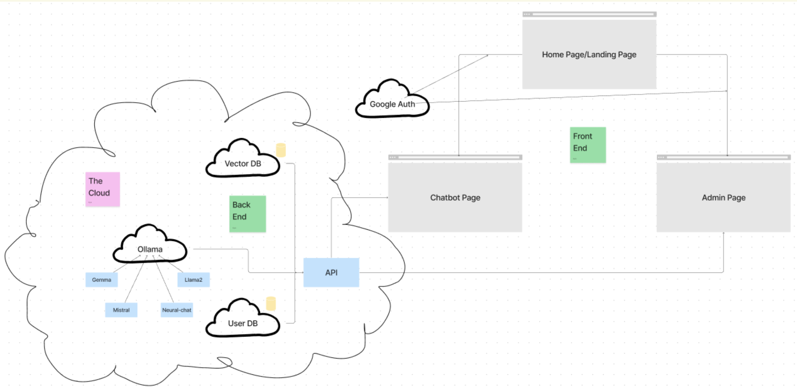

# AgInsuranceLLM
This project aims to address the complexity and confusion surrounding insurance policy selection by developing a conversational assistant tailored for an agricultural insurance program in the US. The assistant will simplify the understanding of insurance terms and aid users in making informed decisions about coverage options. Focusing on the detection of rainfall deficits in insured pasture, forage, and rangelands, the assistant will offer clear explanations, visualizations, and guidance on selecting appropriate insurance terms. Additionally, the project may include simulations to illustrate the potential impact of different choices. Ultimately, this tool seeks to empower users to confidently navigate their insurance options and manage financial risks effectively.

## File Structure
```
.
├── chatbot     <-- fronted
├── ChromaDB    <-- vector db population
├── kube        <-- kubernetes config files
├── LLM         <-- backend
├── redis       <-- user db
└── TestBench   <-- testing files and infrastructure 
```

## System Design
This project is built on a microservices architecture in the cloud, enabling individual scaling of components based on demand. The core architecture comprises separate microservices like the Vector DB, User DB, API, and AI-related services (Gemma, Mistral, Neural-chat, Llama2, Ollama), each independently scalable to accommodate fluctuating loads. The front-end components (Home Page, Chatbot Page, Admin Page) can also scale independently to handle varying user traffic. This microservices approach in the cloud architecture ensures optimal performance, efficient resource utilization, and high scalability across the entire system. 



## Frontend

## Backend

## Ollama

## Databases

## Testing

## Production Deployment

## Insurance Resources  
- [USDA site for insurance computation](https://public-rma.fpac.usda.gov/apps/PRF#)
- Problem with this also lacks significant functionality to support potential policyholders in quickly predicting the impacts of their choices.
- [Insurance Programs](https://www.rma.usda.gov/en/Policy-and-Procedure/Insurance-Plans/Pasture-Rangeland-Forage)
- [Insurance documentation](https://www.rma.usda.gov/-/media/RMA/Handbooks/Coverage-Plans---18000/Rainfall-and-Vegetation-Index---18150/2024-18150-1-Rainfall-Index-Handbook.ashx?la=en)


